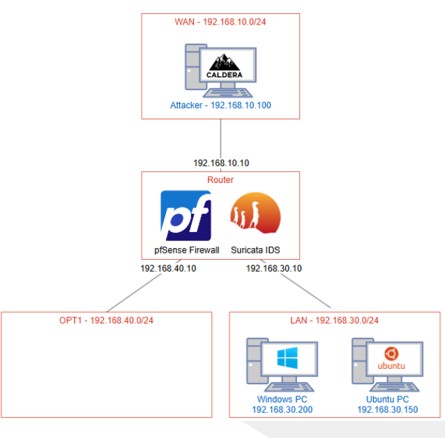
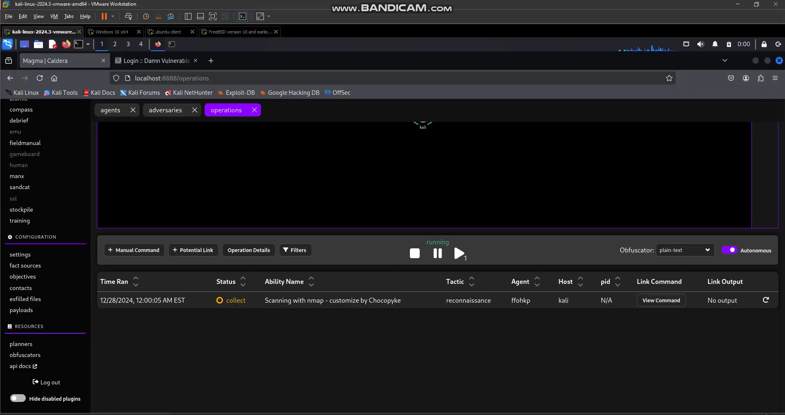
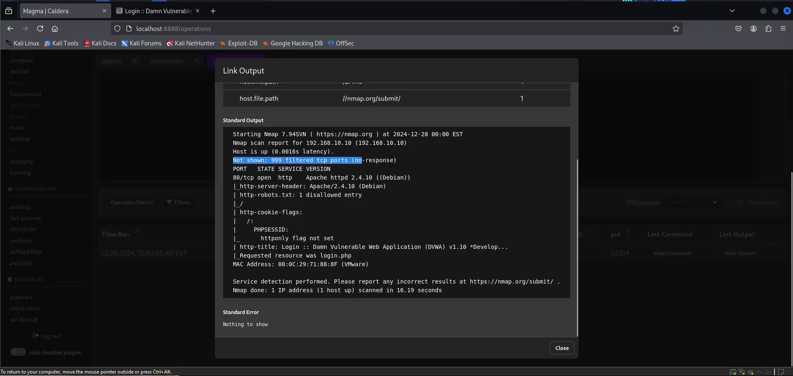
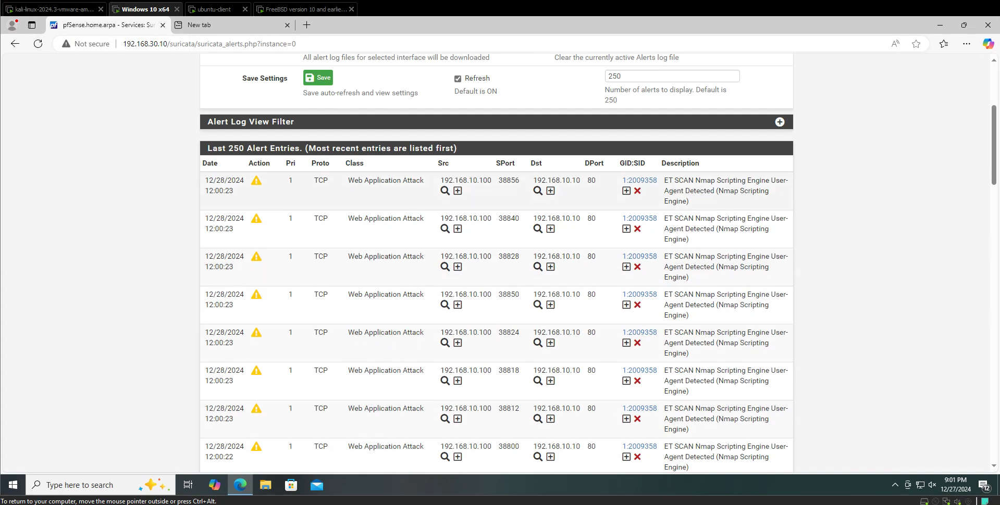
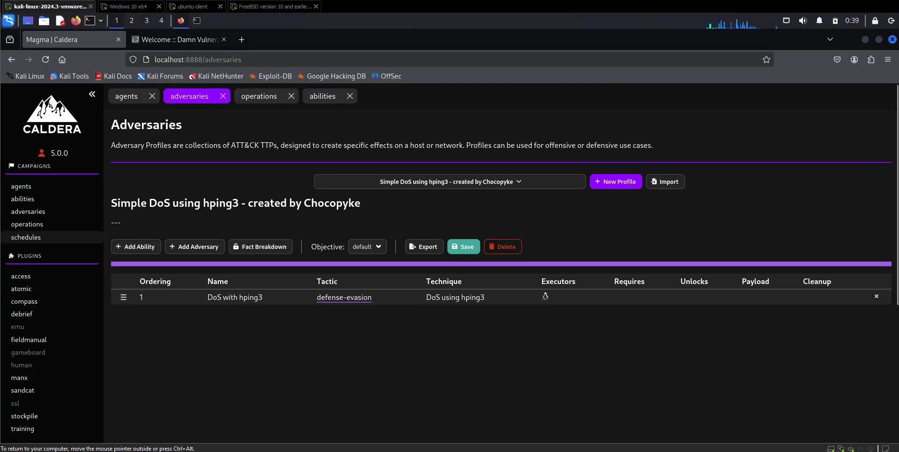
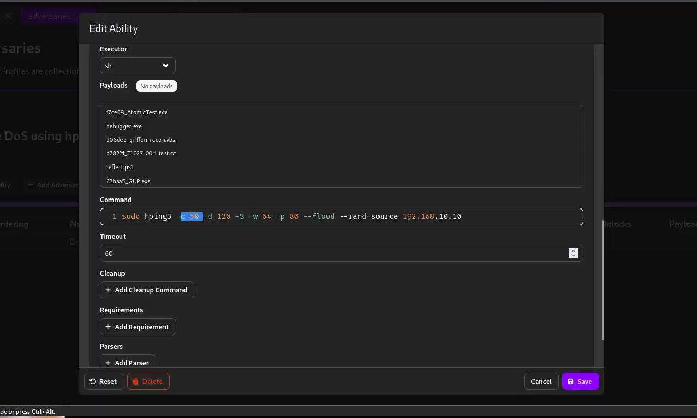
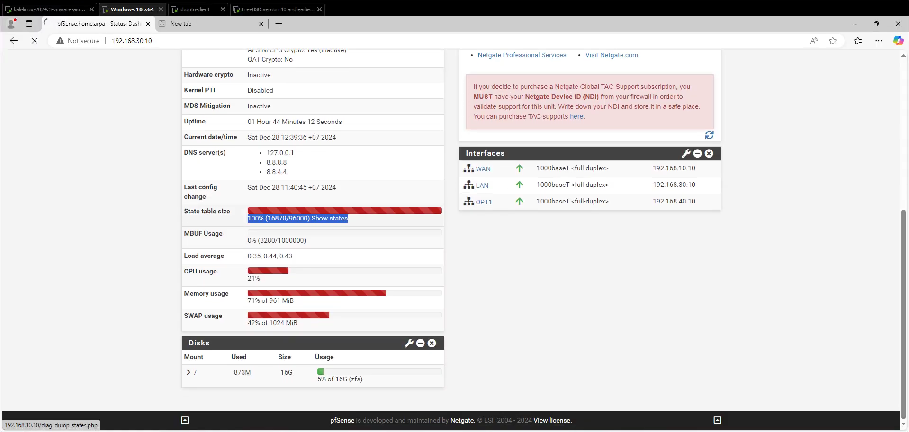
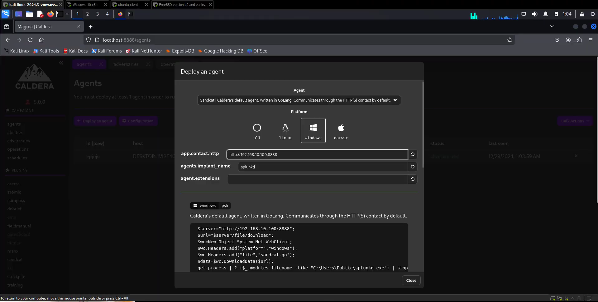
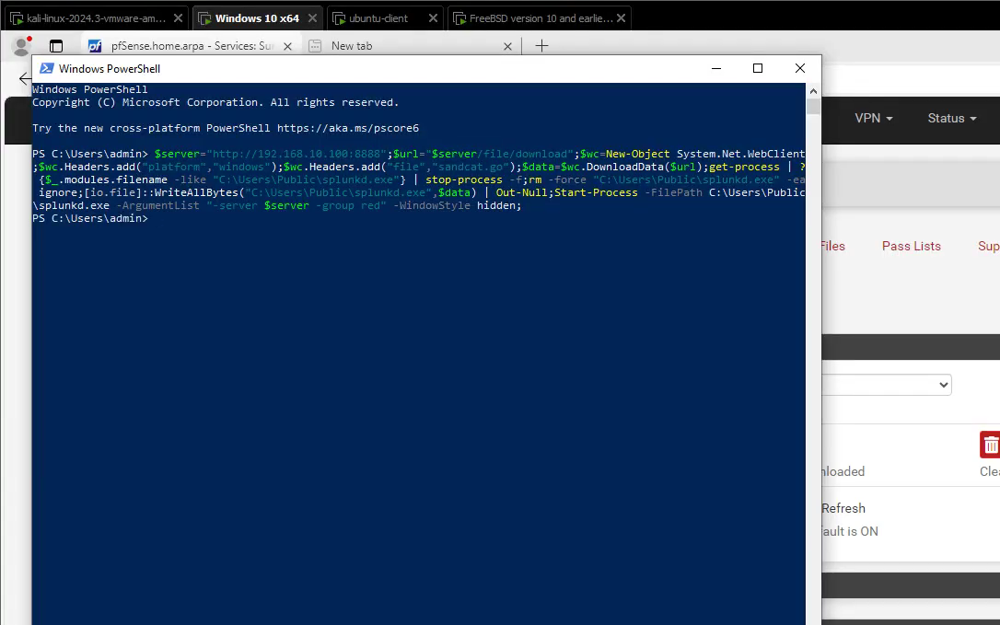
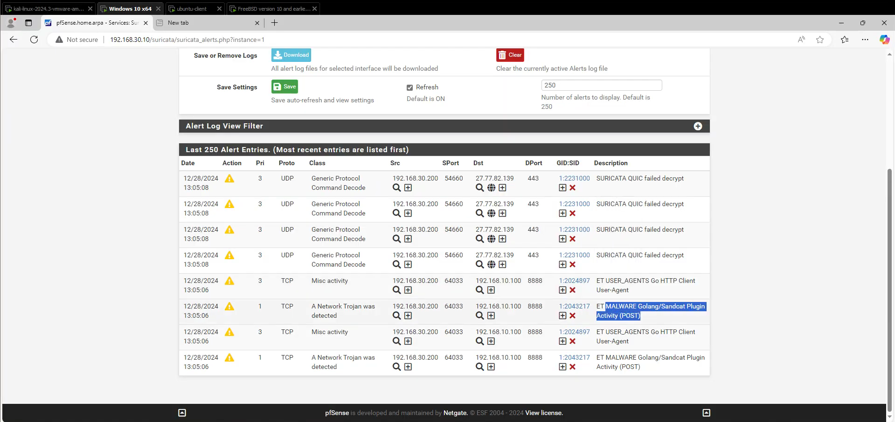

# Caldera-simulated-attack
# Overview
In this project, i am leverage Caldera, a powerful open-source BAS tool developed by MITRE including pfSense Firewall and Suricata IPS, to validate detection, prevention, and response capabilities in a realistic network environment

# Prerequisites
- VMWare installed
- Basic knowledge of networking and virtualization concepts

# Proposed scheme
The system, which was deployed in VMware, simulate attacks from Caldera, collect log from PfSense (IPS: Suricata), Services, Security devices and be able to analyze and store.
Build the system includes 2 separate zones: LAN, WAN. These 2 zones connect to each other through a PfSense firewall.
- LAN: 192.168.30.x ; 2 Clients (Ubuntu, Windows)
- WAN: 192.168.10.x ; Attacker (Caldera)
- Firewall: Install IPS Suricata packets. 3 Interfaces Network (WAN: 192.168.10.10, LAN: 192.168.30.10, OPT1: 192.168.40.10)
- Install Caldera AGENT on Attacker devices

# Result
## 1. Simulate Recon scanning and detect it by PfSense FW
- First of all, i will using Caldera to simulate a Recon attack

- Recon output:

- PFSense FW will alert the attacks

## 2. Simulate DoS Attack
- Using Caldera to simulate DoS attack to FW:

- Command to build Adversaries:

- Result:

## 3. Detect C2 Traffic by Pfsense FW
- Using Caldera to generate script install Agent to Windows Client

- Use that script to run in Windows Client

- Pfsense will alert the C2 Traffic

